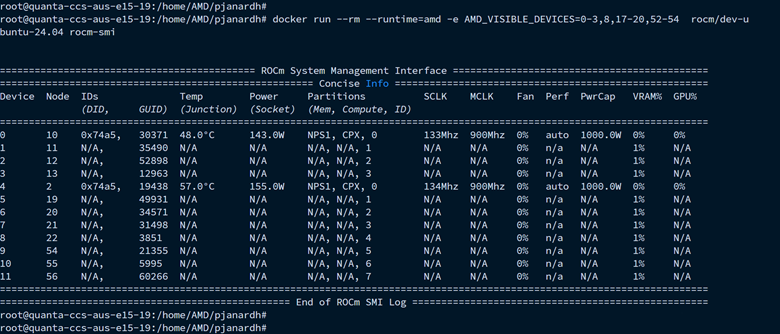

Quick Start Guide
=================

This section provides a step-by-step guide to install the AMD Container Toolkit and configure your system for Docker-based GPU container workloads. The steps below are tailored for ease of use, production-readiness, and ensuring compatibility across AMD Instinct GPU-enabled systems.

Prerequisites
-------------

Before installing the AMD Container Toolkit, ensure the following dependencies are installed.

- **Docker:**  
   - The toolkit is designed to work with Docker, so ensure you have Docker installed on your system.
   - Docker version 25.0 or newer is required for all features.
   - On Linux, use **Docker Engine** (e.g. ``docker.io`` or Docker's official repository) for GPU workloads. Docker Desktop on Linux does not expose host devices such as ``/dev/kfd`` and ``/dev/dri`` to containers; if you see "no such file or directory" for these devices, see :doc:`troubleshooting`.

.. note::
      - The Container Device Interface (CDI) format, used by modern container runtimes to abstract and expose GPUs, is not supported in older Docker versions.
      - Without Docker 25+, CDI functionality such as dynamic device enumeration and CDI-style run commands will not work as intended. 
  
   - Docker version 28.3.0 or newer is required to use the standardized ``--gpus`` flag for AMD GPU selection.

.. code-block:: bash

   sudo apt-get install docker.io

You can verify your Docker version using:

.. code-block:: bash

   docker --version

If you are on an earlier Docker version, please upgrade to at least Docker 25 before proceeding with toolkit configuration and GPU-based workloads.

- **ROCm:**

  - ROCm 6.4.1 or newer is required to view and verify partitioned GPUs inside containers.

**jq** - Required during uninstallation to parse configuration settings cleanly.

.. code-block:: bash

   sudo apt-get install jq

Step 1: Update System and Group Settings
----------------------------------------
- Update your system:

.. code-block:: bash

   sudo apt update

- Add your user to the required groups for GPU device access:

.. code-block:: bash

   sudo usermod -a -G render,video $LOGNAME

Step 2: Install the AMDGPU Driver
---------------------------------

- Refer to the latest ROCm documentation for driver installation here, `ROCm Install Quick Start <https://rocm.docs.amd.com/projects/install-on-linux/en/latest/install/quick-start.html>`_.
- Download the AMDGPU driver installer package from the `Radeon Repository <https://repo.radeon.com/amdgpu-install>`_.
- Install the downloaded package.
- Load the driver.

.. code-block:: bash

   #Example (for Ubuntu 22.04, ROCm 6.3.4)
   wget https://repo.radeon.com/amdgpu-install/6.3.4/ubuntu/jammy/amdgpu-install_6.3.60304-1_all.deb
   sudo apt install ./amdgpu-install_6.3.60304-1_all.deb
   sudo apt update
   amdgpu-install --usecase=dkms
   sudo modprobe amdgpu

Step 3: Configure Repositories
-------------------------------

- Install required dependencies:

.. code-block:: bash

   sudo apt update
   sudo apt install vim wget gpg

- Create keyrings directory:

.. code-block:: bash

   sudo mkdir --parents --mode=0755 /etc/apt/keyrings

- Install GPG keys and repository links:

.. code-block:: bash

   wget https://repo.radeon.com/rocm/rocm.gpg.key -O - | gpg --dearmor | sudo tee /etc/apt/keyrings/rocm.gpg > /dev/null

- Add the AMD Container Toolkit repository.

Ubuntu 22.04:

.. code-block:: bash

   echo "deb [arch=amd64 signed-by=/etc/apt/keyrings/rocm.gpg] https://repo.radeon.com/amd-container-toolkit/apt/ jammy main" | sudo tee /etc/apt/sources.list.d/amd-container-toolkit.list

Ubuntu 24.04:

.. code-block:: bash

   echo "deb [arch=amd64 signed-by=/etc/apt/keyrings/rocm.gpg] https://repo.radeon.com/amd-container-toolkit/apt/ noble main" | sudo tee /etc/apt/sources.list.d/amd-container-toolkit.list

- Update package index and install the toolkit:

.. code-block:: bash

   sudo apt update

RHEL 9.5:

.. code-block:: bash

   tee --append /etc/yum.repos.d/amd-container-toolkit.repo <<EOF
   [amd-container-toolkit]
   name=amd-container-toolkit
   baseurl=https://repo.radeon.com/amd-container-toolkit/el9/main/
   enabled=1
   priority=50
   gpgcheck=1
   gpgkey=https://repo.radeon.com/rocm/rocm.gpg.key
   EOF

Step 4: Install Toolkit and Docker
----------------------------------

Ubuntu:

.. code-block:: bash

   sudo apt install amd-container-toolkit

RHEL 9.5:

- Clean the package cache and install the toolkit:

.. code-block:: bash

   dnf clean all
   dnf install -y amd-container-toolkit

Step 5: Configure Docker Runtime for AMD GPUs
---------------------------------------------

- Register the AMD container runtime and restart the Docker daemon:

.. code-block:: bash

   sudo amd-ctk runtime configure
   sudo systemctl restart docker

This configuration ensures that Docker is aware of the AMD container runtime and is able to support GPU-accelerated workloads using AMD Instinct devices.

Step 6: Verify Container Runtime Installation
---------------------------------------------

To run Docker containers with access to AMD GPUs, you need to specify the AMD runtime and visible GPUs. Here are some examples you can use to verify the installation:

Run a container with access to all available AMD GPUs:

.. code-block:: bash

   docker run --runtime=amd -e AMD_VISIBLE_DEVICES=all rocm/dev-ubuntu-24.04 amd-smi monitor

Output should look like this, validating that all GPUs are visible:

.. code-block:: bash

   GPU  POWER   GPU_T   MEM_T   GFX_CLK   GFX%   MEM%   ENC%   DEC%      VRAM_USAGE
     0  137 W   41 °C   36 °C   142 MHz    0 %    0 %    N/A    0 %    0.3/192.0 GB
     1  139 W   39 °C   33 °C   135 MHz    0 %    0 %    N/A    0 %    0.3/192.0 GB
     2  138 W   42 °C   34 °C   145 MHz    0 %    0 %    N/A    0 %    0.3/192.0 GB
     3  141 W   39 °C   33 °C   139 MHz    0 %    0 %    N/A    0 %    0.3/192.0 GB
     4  140 W   42 °C   36 °C   146 MHz    0 %    0 %    N/A    0 %    0.3/192.0 GB
     5  137 W   38 °C   33 °C   133 MHz    0 %    0 %    N/A    0 %    0.3/192.0 GB
     6  139 W   43 °C   36 °C   151 MHz    0 %    0 %    N/A    0 %    0.3/192.0 GB
     7  137 W   41 °C   34 °C   141 MHz    0 %    0 %    N/A    0 %    0.3/192.0 GB

Run a container with access to a specific AMD GPU (i.e., the first GPU):

.. code-block:: bash

   docker run --runtime=amd -e AMD_VISIBLE_DEVICES=0 rocm/dev-ubuntu-24.04 amd-smi monitor

Output should look like this, validating that only the first GPU is visible:

.. code-block:: bash

   GPU  POWER   GPU_T   MEM_T   GFX_CLK   GFX%   MEM%   ENC%   DEC%      VRAM_USAGE
     0  140 W   42 °C   36 °C   146 MHz    0 %    0 %    N/A    0 %    0.3/192.0 GB

Using ``--gpus`` Flag with Docker 28.x+
---------------------------------------

Starting from Docker **28.3.0**, containerized GPU workloads can leverage the standardized ``--gpus`` flag for specifying AMD GPU usage. The AMD Container Toolkit integrates seamlessly with this interface, enabling users to declare GPU requirements directly in `docker run` commands.

**Examples**

1. **Use all available GPUs**

   ::

       sudo docker run --rm --runtime=amd --gpus all rocm/dev-ubuntu-24.04 rocm-smi

   or equivalently:

   ::

       sudo docker run --rm --runtime=amd --gpus device=all rocm/dev-ubuntu-24.04 rocm-smi

2. **Use any 2 GPUs**

   ::

       sudo docker run --rm --runtime=amd --gpus 2 rocm/dev-ubuntu-24.04 rocm-smi

   .. note::
      Specifying multiple values in a comma-separated list like ``--gpus 1,2,3`` will result in **only the last number** being recognized. For instance, that same input would end up requesting **3 GPUs**.

3. **Select a specific set of GPUs**

   ::

       sudo docker run --rm --runtime=amd --gpus '"device=1,2,3"' rocm/dev-ubuntu-24.04 rocm-smi

   .. note::
      * GPU indices start from **0**.
      * The ``device=`` specifier is **mandatory** when enumerating specific GPUs.

4. **Select one specific GPU**

   ::

       sudo docker run --rm --runtime=amd --gpus device=2 rocm/dev-ubuntu-24.04 rocm-smi

   .. note::
      * Again, the **``device=``** prefix is required.

**Summary**

- Use ``--gpus <count>`` to request a specific number of GPUs (e.g., ``--gpus 2``)
- Use ``--gpus device=<i,j,...>`` to request exact GPU indices (e.g., ``device=1,2,3``)

GPU Partitioning: Enabling Fine-Grained Resource Allocation
-----------------------------------------------------------

GPU partitioning empowers users to divide a single physical GPU into multiple logical units, each of which can be independently accessed and managed within containerized workloads. This capability is essential for fine-grained control over GPU resources, enabling scenarios such as workload isolation, resource sharing, and maximizing GPU utilization within containerized environments.

Starting with version **1.1.0**, the AMD Container Toolkit introduces full support for **GPU partitioning**

.. note::
   Partitioned GPUs behave identically to physical GPUs within containers. Applications and monitoring tools like `rocm-smi` or `amd-smi` will detect and report them as separate devices.

Partitioning Schemes and Access
~~~~~~~~~~~~~~~~~~~~~~~~~~~~~~~

With the AMD Container Toolkit, you can apply various partitioning schemes to your GPUs. Once partitioned, each logical GPU appears to the container runtime as a distinct device, indistinguishable from a standard, unpartitioned GPU. This allows you to allocate specific GPU partitions to different containers, optimizing performance and isolation. This functionality is particularly useful in multi-tenant or resource-constrained environments where full GPU allocation is not necessary.

Regenerating and Validating CDI Specifications
~~~~~~~~~~~~~~~~~~~~~~~~~~~~~~~~~~~~~~~~~~~~~~

Whenever you modify the GPU partitioning on your system, it is must to regenerate the Container Device Interface (CDI) specification. This ensures that the container runtime is aware of the current GPU topology and can accurately expose the correct devices to your containers.

You can regenerate and validate the CDI spec either by specifying an explicit output path or by using the default location.

**To regenerate the CDI spec with an explicit output path after a partitioning change, run:**

.. code-block:: bash

   amd-ctk cdi generate --output=/etc/cdi/amd.json

To validate that the existing CDI spec accurately reflects the available GPUs and partitions, use:

.. code-block:: bash

   amd-ctk cdi validate --path=/etc/cdi/amd.json

**Alternatively, you may omit the path to use the default CDI spec location:**

.. code-block:: bash

   amd-ctk cdi generate
   amd-ctk cdi validate

.. note::
   If you do not specify an output or path, the commands will operate on the default CDI spec location as defined by the toolkit. This is suitable for most standard installations.

Inspecting GPU Partition Status
~~~~~~~~~~~~~~~~~~~~~~~~~~~~~~~

You can use the `amd-smi` tool inside your container to inspect the status of each GPU, determine whether it is partitioned or unpartitioned, and view details about the partitioning scheme in use.

.. code-block:: bash

   docker run --rm --runtime=amd -e AMD_VISIBLE_DEVICES=all rocm/dev-ubuntu-24.04 amd-smi

Selecting GPUs and Partitions
~~~~~~~~~~~~~~~~~~~~~~~~~~~~~

Partitioning can result in a large number of logical GPUs on your system. To simplify device selection, the AMD Container Toolkit supports specifying a range or set of GPUs using the `AMD_VISIBLE_DEVICES` environment variable. For example:

.. code-block:: bash

   docker run --rm --runtime=amd -e AMD_VISIBLE_DEVICES=0-3,8,17-20,52-54 rocm/dev-ubuntu-24.04 amd-smi

This command grants the container access to GPUs 0 through 3, 8, 17 through 20, and 52 through 54. The range specifier is especially useful for efficiently targeting all partitions within specific physical GPUs, as partitions are typically numbered contiguously.

.. note::
   To view and verify partitioned GPUs inside containers, ensure you are using ROCm version 6.4.1 or newer.

Best Practices and Documentation
~~~~~~~~~~~~~~~~~~~~~~~~~~~~~~~~

- **Always regenerate the CDI spec** after any GPU partitioning change to ensure containers have access to the correct devices.
- **Validate the CDI spec** to confirm it matches the current system state before launching new workloads.
- **Consult the latest documentation** for detailed partitioning workflows and troubleshooting guidance.

By leveraging GPU partitioning, you can achieve fine-grained resource allocation, improved workload isolation, and greater flexibility in deploying GPU-accelerated containers across your infrastructure.

Uninstallation Guide
--------------------

To remove the `amd-container-toolkit`, you must have `jq` installed. The uninstallation script relies on it to parse configuration files.

.. code-block:: bash

   sudo apt-get install jq

Then proceed with the removal:

.. code-block:: bash

   sudo apt-get remove --purge amd-container-toolkit

If you encounter issues, inspect the logs:

.. code-block:: bash

   sudo journalctl -u apt

   sudo tail -f /var/log/amd-container-runtime.log

If you continue to face errors, you may need to force the removal:

.. code-block:: bash

   sudo dpkg --remove --force-all amd-container-toolkit

   sudo apt-get autoremove
